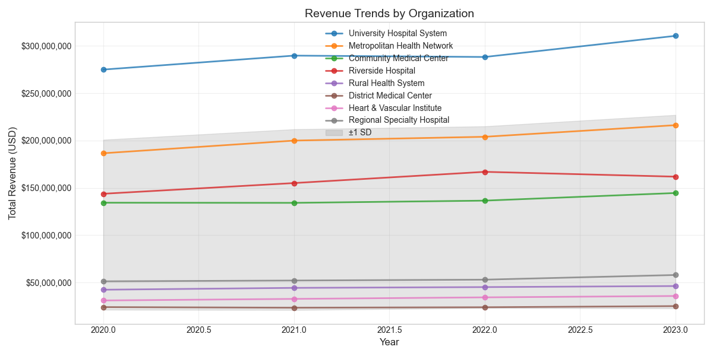
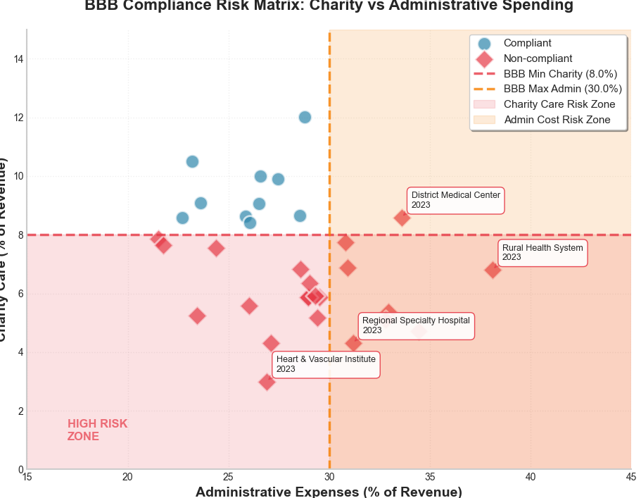

# NPO Healthcare Financial Analysis

Analysis of nonprofit hospital financial performance and compliance with proposed Big Beautiful Bill (BBB) legislation.

## Overview

This project analyzes nonprofit healthcare organizations' financial data to assess:
- Charity care spending patterns
- Administrative expense ratios
- Compliance with proposed BBB thresholds
- Financial trends over time

## Key Findings

Based on the sample analysis:
- **37.5%** of observations were non-compliant with BBB requirements
- Average charity care: **7.8%** of revenue (just below the 8% minimum)
- Average administrative expenses: **25.8%** of revenue
- Organizations like Heart & Vascular Institute show the highest compliance risk

## Visualizations

The analysis generates two key visualizations:

1. **Revenue Trends** - Shows financial growth patterns across organizations
2. **BBB Compliance Risk Matrix** - Identifies which hospitals may struggle to meet proposed requirements

## Sample Output

### Revenue Trends


### BBB Compliance Risk Matrix  


## Requirements

```bash
pip install -r requirements.txt
Dependencies:

pandas >= 1.3.0
numpy >= 1.21.0
matplotlib >= 3.4.0
seaborn >= 0.11.0

Usage

Generate sample data:

bashpython generate_data_script.py

Run the analysis:

bashpython npo_healthcare_improved.py
Data Format
The analysis expects CSV data with the following columns:

year: Fiscal year (int)
organization: Hospital name (str)
total_revenue: Annual revenue in USD (float)
charity_care: Uncompensated care provided (float)
admin_expense: Administrative expenses (float)
community_benefit: Community benefit spending (float)
hospital_type: Optional, 'General' or 'Specialty' (str)

BBB Compliance Criteria
The analysis evaluates compliance with two key thresholds:

Minimum charity care: 8% of total revenue
Maximum administrative expense: 30% of total revenue

Output
The script generates:

Revenue trend visualizations
BBB compliance risk matrix
Statistical summary with year-over-year changes
Processed data with compliance flags (npo_healthcare_analysis_results.csv)

Project Structure
npo-healthcare-analysis/
├── generate_data_script.py      # Generate sample data
├── npo_healthcare_improved.py   # Main analysis script
├── requirements.txt             # Python dependencies
├── README.md                    # This file
├── .gitignore                   # Git ignore rules
└── data/                        # Data files (generated)
    ├── npo_healthcare_sample.csv
    └── npo_healthcare_analysis_results.csv
Future Enhancements

Integration with real IRS 990 data via API
Machine learning models for compliance prediction
Interactive dashboard for policy makers
Regional analysis capabilities

License
MIT